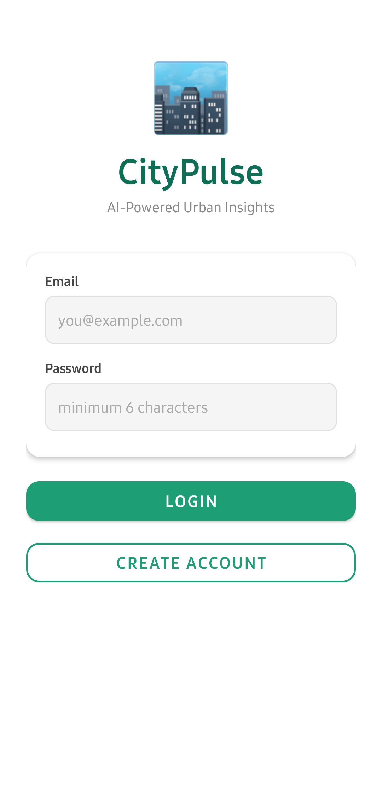
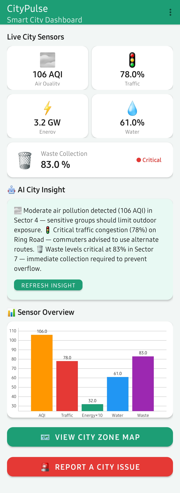
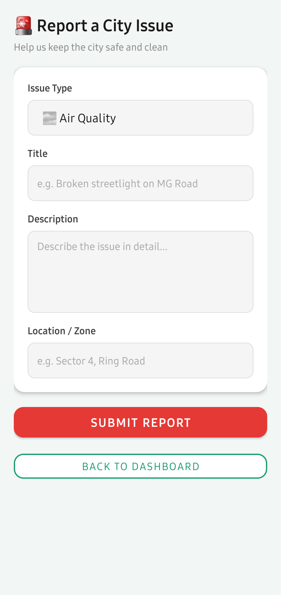
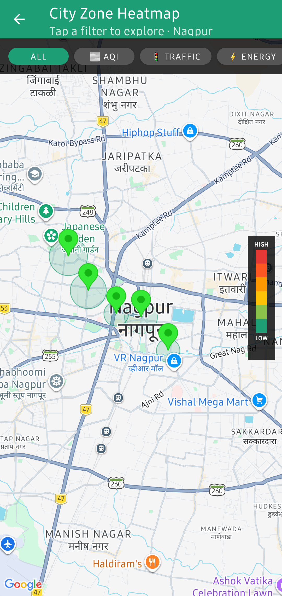
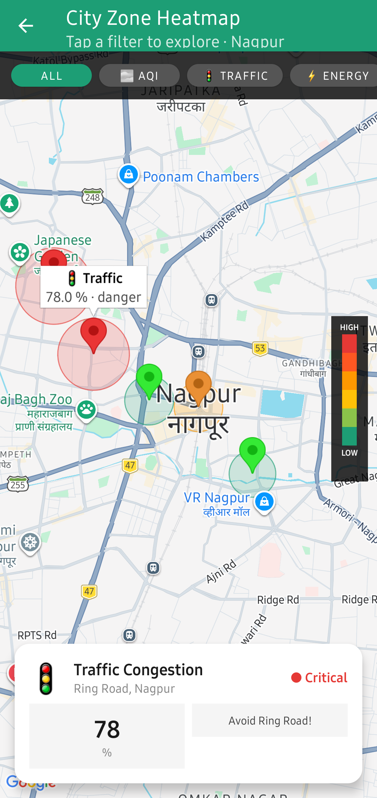
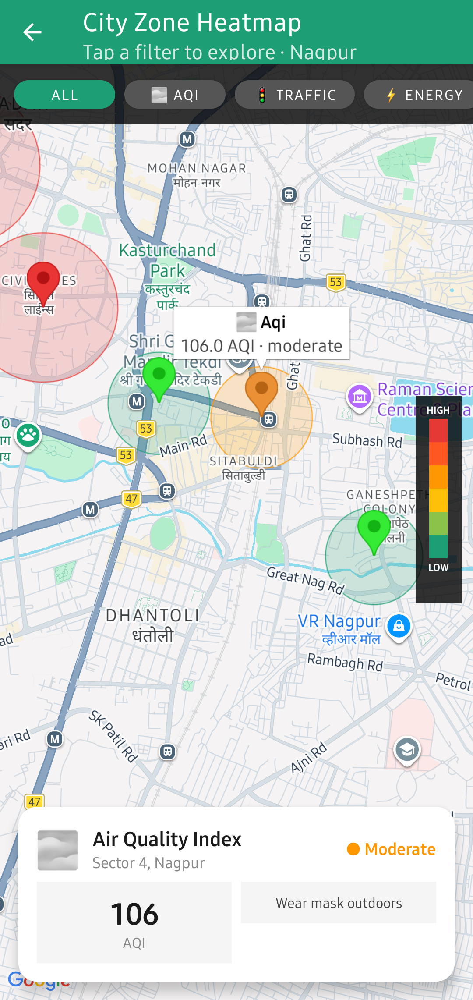

<div align="center">
  <h1>CityPulse</h1>

  <p>
    
    
    
    
  </p>
</div>

<div align="center">
  <p><strong>Hackathon Project</strong></p>
  <p><strong>Domain:</strong> Data Science</p>
  <p><strong>Problem Statement:</strong> AI-Powered Urban Insights Platform</p>
</div>

CityPulse is an Android smart-city dashboard app built with Kotlin, Firebase, and Google Maps.

It provides:
- live city sensor visibility (AQI, traffic, energy, water, waste)
- AI-generated (or local fallback) citizen insight
- city zone heat-map view
- issue reporting workflow
- Firebase email/password authentication

## Tech Stack

- Kotlin + Android Views (ViewBinding)
- Firebase Authentication
- Firebase Firestore
- Google Maps SDK (Android)
- MPAndroidChart
- Kotlin Coroutines
- AndroidX Navigation

## Modules and Key Screens

- `ui/auth/LoginFragment`  
  Login and registration using Firebase Auth.
- `ui/dashboard/DashboardFragment`  
  Sensor cards, chart, AI insight panel, navigation to map and report.
- `ui/map/MapFragment`  
  Large heat-zone map rendering for city sensor hotspots.
- `ui/report/ReportFragment`  
  Submit city issue reports to Firestore.

## App Screenshots

<table align="center" border="0" cellspacing="0" cellpadding="8" style="border-collapse: collapse; border: none;">
  <tr style="border: none;">
    <td align="center" style="border: none;">
      
      <div><sub><b></b>Login Screen<b>/sub></div>
    </td>
    <td align="center" style="border: none;">
      
      <div><sub><b></b>Dashboard Screen</b></sub></div>
    </td>
    <td align="center" style="border: none;">
      
      <div><sub><b></b>Report Issue Screen</b></sub></div>
    </td>
    <td align="center" style="border: none;">
      
      <div><sub><b>City Zone Heat Map View 1<b></b></sub></div>
    </td>
    <td align="center" style="border: none;">
      
      <div><sub><b>City Zone Heat Map View 2<b></sub></div>
    </td>
    <td align="center" style="border: none;">
      
      <div><sub><b>City Zone Heat Map View 3<b></sub></div>
    </td>
  </tr>
</table>

## Project Requirements

- Android Studio (latest stable recommended)
- Android SDK `compileSdk = 34`
- JDK 21
- Gradle wrapper (included)
- Internet access on emulator/device

## Firebase Setup

1. Create or open a Firebase project.
2. Add Android app with package: `com.sanket.citypulse`.
3. Download `google-services.json` and place it in:
   - `app/google-services.json`
4. Enable Firebase Authentication:
   - Sign-in method: **Email/Password**
5. Enable Cloud Firestore.

## Firestore Collections Used

### `users`
Document ID: Firebase UID

Example fields:
- `uid` (String)
- `name` (String)
- `email` (String)
- `role` (String, default: `citizen`)

### `sensor_readings`
Example document fields:
- `type` (String): one of `aqi`, `traffic`, `energy`, `water`, `waste`
- `value` (Number)
- `unit` (String)
- `status` (String): `good`, `moderate`, `danger`

### `city_reports`
Created from report form with fields:
- `id`, `userId`, `title`, `description`, `location`, `category`, `status`, `timestamp`

## Maps Configuration

Google Maps API key is read from Android Manifest metadata:

- `com.google.android.geo.API_KEY`

Current location in project:
- `app/src/main/AndroidManifest.xml`

## AI Insight Configuration

AI insight currently attempts Gemini generation and gracefully falls back to local rule-based insight if API/model access is unavailable.

API key is currently defined in:
- `app/src/main/java/com/sanket/citypulse/ui/dashboard/DashboardFragment.kt`

For production, move keys to a secure backend or secret management flow.

## Build and Run

From Android Studio:
1. Sync Gradle.
2. Select emulator/device.
3. Run `app` configuration.

From terminal (Windows PowerShell):

```powershell
.\gradlew.bat :app:assembleDebug
```

Install debug APK:

```powershell
.\gradlew.bat :app:installDebug
```

## Navigation Flow

`Login -> Dashboard -> (Map | Report)`

Navigation graph:
- `app/src/main/res/navigation/nav_graph.xml`

## Troubleshooting

### App shows AI model/API errors
- Confirm internet access on device/emulator.
- Ensure Gemini API key has access for model generation.
- If unavailable, app should still show local fallback insight.

### Map not visible or blank
- Verify Maps API key is valid and billing/API is enabled in Google Cloud.
- Rebuild and reinstall app after key changes.

### Firebase auth/report fails
- Confirm Firebase project config and `google-services.json` match package `com.sanket.citypulse`.
- Verify Firestore rules permit expected reads/writes for your environment.

## License

No license file is currently included in this repository.
